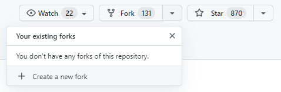
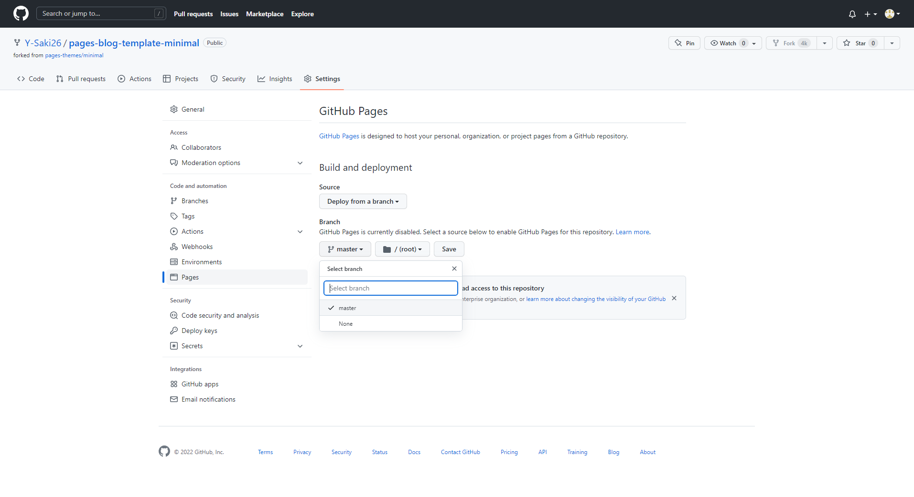
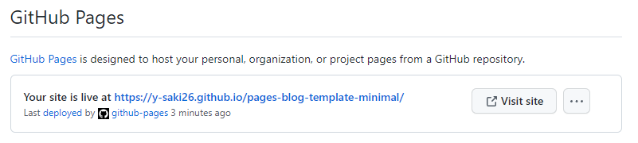

# Blog Template on GitHub Pages (Miminal)

## GitHub Pages で簡単にWebサイトを作る

1. このレポジトリを Fork する．(図1. 「+ Create a new fork」を押下し，Repository name や Description を設定し，「Create Fork」を押下して完了)  
またはブログにしたいレポジトリにこのレポジトリの中身を展開し直下に置く．
2. 「Settings」タブ→「Pages」→ Branch を「master」に指定して Save．
3. デプロイが終われば（「Actions」タブで進捗を確認できる．数分～十数分）「Pages」の上部にWebサイトのリンクが表示される（図3.）．  
デフォルトのURLは `https://<ユーザー名(lower case)>.github.io/<レポジトリ名>/`．


図1


図2


図3

## カスタマイズ

`_config.yml` で全体のパラメータを設定．

```yaml
title: Blog Template        # サイトの名前
description: Blog Template on GitHub Pages with Jekyll theme Miminal # サイトの説明
url: https://y-saki26.github.io/pages-blog-template-minimal/ # サイトのURL
logo: /assets/img/logo.png  # ページ左上に表示されるロゴ画像
favicon_assets: /pages-blog-template-minimal/assets/favicons/ # ファビコンの所在
show_downloads: false       # ダウンロードボタンの表示
github:
  is_project_page: true     # プロジェクトページへのリンクの表示
  is_user_page: true        # ユーザーページへのリンクの表示
google_analytics:           # Google AnalyticsのトラッキングID
theme: jekyll-theme-minimal # テーマ
plugins:
  - jekyll-sitemap          # サイトマップを自動生成するプラグイン
```
